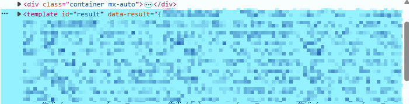

# 如何使用 Vue 一步一步重构 Flask 项目

项目背景是在一个 Flask 做后端的前后端不分离项目中使用 Vue3 重构使用 Jinja2 模板引擎的原页面。很遗憾，原来的 Flask 项目也是我亲手拉的一坨，实际上已经重构了几次，这次准备一步到位做成前后端分离项目。

## 开拉

最初项目是一个 Python 制作的 CLI 工具，通过读写文件来输入输出。我接手时的任务是将它做成 Web 页面，那时它只有三个小功能，想着直接用 Python 起一个服务器简单写写 HTML 就给做了，随即学了学 Flask 框架和与之搭配的 Jinja 模板引擎，~~不得不说这些 Python 库的文档是真的难读，现在想起来还后怕~~然后想着搭配着 TailwindCSS 写了一些样式就交付部署了。

## 上忍

私以为能读好 Flask和 Jinja 的文档就已经算是上忍，我真的不太想得到纯 Flask / Python 全栈是怎么做的。

## 中忍

好吧，最开始在看文档时、传递参数时、写模板时虽然有些难受，但有着新鲜感还是能忍忍，不过最后大概实在习惯不了这个超级烦的[模板语法](https://docs.jinkan.org/docs/jinja2/templates.html)，我尝试在 HTML 中引入 [AlpineJS](https://alpinejs.dev)，这个轻量化的前端框架是真的蛮好用的，有一种 Vue 的感觉。不过，客户端框架所需的数据还是需要借助 Flask 模板生成，实际用起来是这样的：

```jinja

<template id="result" data-result="{{result}}"></template>
<script>
    const result = JSON.parse(document.getElementById('result').dataset.result)
    console.log(Object.keys(result))
    console.log(result)
<script>

```

而看起来是这样的：



使用 [`<template>` 元素](https://developer.mozilla.org/zh-CN/docs/Web/HTML/Element/template)在浏览器页面不会实际渲染，emmmm，虽然在 DevTools 观感不太好，不过能用，能用就行😇其他有关 AlpineJS 的语法细节我就不细说了，总之使用体验蛮好的！

## 叛……？下忍

使用 AlpineJS 之后，开发体验直线上升，很符合我的的开发思路。不过，在功能添加到 5 个左右的时候，由于各个 Tab 表单都在一个 `.html` 中，这个文件已经有 400 行左右了，部分功能的详情表格页面也逼近 200 行，不过其实大部分都是重复的样式和结构代码，虽然大多数情况下也不会改动它，但是也让我很头疼。在最初的阶段曾尝试过使用 Jinja 的 `macro` 进行组件化，不知怎么的，总是感觉用着 `macro` 很不舒服，感觉不如……原，啊不是，感觉不如复制粘贴……


不知道哪里来的念头，我就想要不试一下 [Astro](https://astro.build)？在我尝试做一个 MVP 的时候发现了问题，我需要在客户端根据不同参数请求到新数据，而 Astro 只能通过 SSR 的方式实现客户端实时请求数据，并且 Astro 的 SSR Adapter 只能运行在各种基于 Javascript 的环境，比如 Node、Deno 还有其他云服务的部署。我的目标部署机器是离线的，也没有 Node，所以……忍忍就过去了……

## 叛忍

在尝试使用 Astro 作为前端时，客户端集成选的就是 Vue，想着可能给下一个接盘的会好写一点~~别问，问就是没有选型讨论~~，然后嘛自然而然就退回到了使用 Vue 实现前端的这条路了。前端换到 Vue 后搭配 Vue Router 很快把原页面逻辑的框架搭了出来，不过这个时候还有几个需要注意的地方：

### serve 前端

还是以我浅薄的经验来说，通常这个 serve 步骤是借助 `nginx` 做的，不过我这里有一个需要开着的服务器，也就是提供数据的这个 Flask 服务器。所以我就在想，能不能让这个 Flask 服务器直接 serve 我打包好的文件。众所周知，Vue 项目 build 之后是一个 `index.html` 和一个装着各种资源 `assets` 目录，我只需要由服务器返回打包后的 `index.html` 而这个 html 就能自己请求需要的各个 js 和 css 等。同时，为了不应该影响原有正在运行的页面，我在 `app.py` 的主路由新增了一条：

```python
@app.route('/frontend/', defaults={'path':'index.html'})
@app.route('/frontend/<path:path>',)
def frontend(path):
    return send_from_directory('frontend/dist', path )
```

解释一下这条路由配置：`/frontend` 有一个名为 `path` 的路径参数，类型约束为 `path`；如果缺少参数则赋值为 `defaults` 中的 `path` 值，也就是 `index.html`。这条路由可以做到当你访问 `/frontend` 时，给你 `index.html` 这个入口文件，这个 html 会逐一请求他所需的资源，这些资源也都在他的同级目录 `assets` 中，所以也匹配到这条路由上。

太完美了，至少我最初是这样想的，而事实证明我想的不太对。在默认配置下，打包后的 `index.html` 中的资源文件路径是从根目录开始的，所以不匹配这条路由，在没有额外配置的情况下会返回 404。

```html
<script type="module" crossorigin src="/assets/index-1m8F0M2F.js"></script>
<link rel="stylesheet" crossorigin href="/assets/index-zp7NvMum.css" />
```

解决这个问题自然要从负责打包的 vite 入手，所以翻了翻 vite 的[配置项文档](https://vite.dev/config/shared-options.html#base)，果然发现 `base` 选项可以更改公共路径的相对位置，所以应该把 `base` 的值也设置为 `/frontend`，这样在打包后 `index.html` 中的资源文件路径便是从 `/frontend` 开始了，也就可以匹配到 `/frontend` 路由了。

```html
<script type="module" crossorigin src="/frontend/assets/index-1m8F0M2F.js"></script>
<link rel="stylesheet" crossorigin href="/frontend/assets/index-zp7NvMum.css" />
```

### 获取数据

很长一段时间我接触的项目在获取数据的时候都会使用 `axios` 这个依赖，不知道为啥。不过在我接触 Astro 的这段时间我用 `fetch` 获取数据的体验蛮好的，所以我不准备安装额外的依赖，只使用 `fetch`，实际上 `fetch` 也不是很新的技术，而且现代浏览器都已经支持了，从 [MDN 的兼容性表](https://developer.mozilla.org/en-US/docs/Web/API/Fetch_API#browser_compatibility) 以及 [caniuse](https://caniuse.com/?search=fetch) 中都可以确认。

### 提交表单

原提交表单的逻辑是开启新页面同时请求详情表格，使用 Flask 不分离的话在提交 `<form>` 时添加 `target="_blank"`，随后后端返回一个 `render_template(...)` 即可。而在分离的情况，我们需要做：

1. 后端新增返回 JSON 的 API
2. 前端开启新的目标页面
3. 新页面请求数据

第一条也就是增加一条路由的事情，不多说，第三条大概是 `onMounted()` 请求一次就好。那么第二条呢？我想着还是使用 `window.open()` 去开一个新标签，这样做便需要拼 url 路径，不过先试试无妨。dev 环境可以跑通，接下来我会说什么呢，是的，prod 环境没跑通。实际的状况是当我开一个同路径的标签页返回了 404，那么问题出在哪里呢……脑中突然响起多年前的八股文声音：使用 WebHistory 模式需要后端配合。所以，我又在 `app.py` 的主路由新增了一条：

```python
@app.route('/frontend/<string:route>')
def frontend_route(route):
  print(route)
  return send_from_directory('frontend/dist', 'index.html')
```

具体的思考过程记不清了，大概就是直觉吧（笑。事后想想也可以理解，Vue 的路由必然是通过打包后的某个 js 文件处理，直接交给 `index.html` 大概就可以吧（本句纯属我自己瞎猜，具体咋实现的我没看）。不过在成功试出来后我还是看了 [Vue Router 有关历史模式的文档](https://router.vuejs.org/zh/guide/essentials/history-mode.html#HTML5-%E6%A8%A1%E5%BC%8F)，这里没有提到 Flask 或是 Python 相关框架的配置，不过有人在 2019 年提交了[更新文档相关的 PR](https://github.com/vuejs/vue-router/pull/2609)，目前仍然 open 状态，被淹没在了 PR 长河中（RIP）。

经过上述的后端路由配置，就可以做到直接新开指定 url 的标签页都能正确由 Vue Router 导航的状态。那第三步，想想也不仅仅是简单“请求一次就好”。我们还需要参数，以及烦人的拼路径，有什么办法可以解决吗？有的！我们可以借助 `router.resolve()` 方法获取到规范化后的 href，这个函数甚至可以直接帮忙组装 `query` 字符串。

```typescript
const route = router.resolve({
  path: fullPath,
  query: form
})
// console.log(route.href)
window.open(route.href, '_blank')
```

这样我们既不用拼路径，也不用拼 `query`，代码也好看，令人身心愉悦~

## Wrapping up

经过上方的一顿折腾，从一个 CLI 工具到使用 Flask 实现的 Web 页面，再借助 Alpine 在客户端渲染的页面，再到 serve 使用 Vue 构建并通过 Vite 打包的 `index.html`，目前自我感觉良好，可能某天我还是会看这些代码不顺眼，那就继续狠狠地重构！这篇文章原本只想说说 Flask 应该如何搭配 Vue Router 使用，没想到介绍背景项目种种竟然写了这么多。实际上这个项目时间扯得比较长，不过搭配 git log 竟然对自己的思考过程记忆还是比较清晰的。

最后最后，如果你发现本文哪里叙述的不准确或是有错误，请和我反馈捏！
